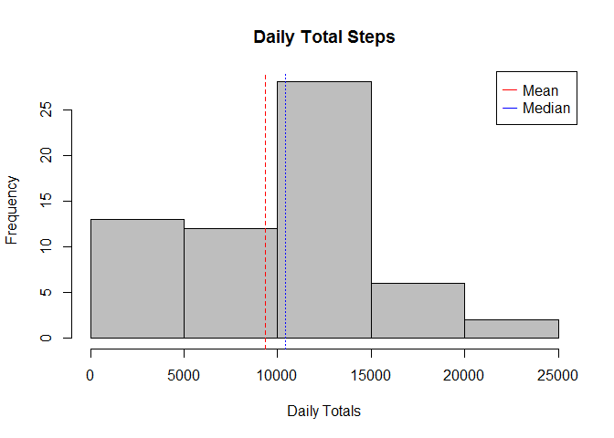

# Reproducible Research: Peer Assessment 1
Robert Bril  
## Introduction

It is now possible to collect a large amount of data about personal
movement using activity monitoring devices such as a
[Fitbit](http://www.fitbit.com), [Nike
Fuelband](http://www.nike.com/us/en_us/c/nikeplus-fuelband), or
[Jawbone Up](https://jawbone.com/up). These type of devices are part of
the "quantified self" movement -- a group of enthusiasts who take
measurements about themselves regularly to improve their health, to
find patterns in their behavior, or because they are tech geeks. But
these data remain under-utilized both because the raw data are hard to
obtain and there is a lack of statistical methods and software for
processing and interpreting the data.

This assignment makes use of data from a personal activity monitoring
device. This device collects data at 5 minute intervals through out the
day. The data consists of two months of data from an anonymous
individual collected during the months of October and November, 2012
and include the number of steps taken in 5 minute intervals each day. 

## Data

The data for this assignment can be downloaded from the course web
site:

* Dataset: [Activity monitoring data](https://d396qusza40orc.cloudfront.net/repdata%2Fdata%2Factivity.zip) [52K]

The variables included in this dataset are:

* **steps**: Number of steps taking in a 5-minute interval (missing
    values are coded as `NA`)
* **date**: The date on which the measurement was taken in YYYY-MM-DD
    format
* **interval**: Identifier for the 5-minute interval in which
    measurement was taken

The dataset is stored in a comma-separated-value (CSV) file and there
are a total of 17,568 observations in this
dataset.

## Load Libraries

```r
library(lubridate)
library(ggplot2)
library(knitr)
library(stringr)
library(scales)

knitr::opts_chunk$set(echo = TRUE)
```
## Loading and preprocessing the data
_Show any code that is needed to_
_Load the data (i.e. read.csv())_
_Process/transform the data (if necessary) into a format suitable for your analysis_


The code assumes you have set the working directory.  If required it will create a download directory and download the dataset and unzip it.
The data are loaded into a main activity dataset ("ACT") with appropriate formatting. 

Note the presence of NAs in the dataset.


```r
if(!file.exists("./data")){
        dir.create("./data")}

if(!file.exists("./data/Act.zip")){
        fileUrl <- "https://d396qusza40orc.cloudfront.net/repdata%2Fdata%2Factivity.zip"
        download.file(fileUrl,destfile = "./data/Act.zip")
        unzip("./data/Act.zip",exdir = "./data")
        file.rename("./data/Activity.csv","./data/Act.csv")
        file.remove("./data/Act.zip")
        rm(fileUrl)
        }

if(!exists("ACT")){
        ACT <- read.csv("../data/Act.csv",na.strings = "NA",stringsAsFactors = FALSE) 
        ACT$date <- as.Date(ACT$date,"%Y-%m-%d")
        ACT$day_type <- weekdays(ACT$date) =="Sunday" | weekdays(ACT$date) =="Saturday"
        ACT$day_type <- factor(ACT$day_type, levels=c(FALSE,TRUE),labels=c("weekday","weekend"))
        ACT$interval <-str_sub(paste(rep("000",nrow(ACT)),ACT$interval,sep=""),start=-4)
}

head(ACT)
```

```
##   steps       date interval day_type
## 1    NA 2012-10-01     0000  weekday
## 2    NA 2012-10-01     0005  weekday
## 3    NA 2012-10-01     0010  weekday
## 4    NA 2012-10-01     0015  weekday
## 5    NA 2012-10-01     0020  weekday
## 6    NA 2012-10-01     0025  weekday
```

## What is mean total number of steps taken per day?
_For this part of the assignment, you can ignore the missing values in the dataset._
_1. Make a histogram of the total number of steps taken each day_
_2.Calculate and report the mean and median total number of steps taken per day_

For this stage the NAs observed earlier were ignored. Some basic statistics for the daily totals are computed.


```r
Daily_Totals <- tapply(ACT$steps,ACT$date,sum,na.rm=TRUE)
mnDT <- mean(Daily_Totals)
mdDT <- median(Daily_Totals)
print(paste("Mean Total Steps/Day:",mnDT))
```

```
## [1] "Mean Total Steps/Day: 9354.22950819672"
```

```r
print(paste("Median Total Steps/Day:",mdDT))
```

```
## [1] "Median Total Steps/Day: 10395"
```

It is observed that the mean is significantly less than the median which implies a skewed distribution. A histogram was plotted to check the distribution of daily totals.


```r
hist(Daily_Totals, col = "gray",main = "Daily Total Steps", xlab="Daily Totals")
abline(v=mnDT, col="red",lty=2)
abline(v=mdDT, col="blue",lty=3)
legend("topright",legend=c("Mean","Median"),pch=151,col=c("red","blue"))
```



## What is the average daily activity pattern?
_1. Make a time series plot (i.e. type = "l") of the 5-minute interval (x-axis) and the average number of steps taken, averaged across all days (y-axis)_

_2. Which 5-minute interval, on average across all the days in the dataset, contains the maximum number of steps?_

In this section the average activity for each five minute time interval over every date was calculated.


```r
Daily_activity <- aggregate(steps~interval,ACT,FUN=mean,na.rm=TRUE)
Daily_activity$Time <- as.POSIXct(strptime(Daily_activity$interval,"%H%M",tz="UTC"))

plot(x=Daily_activity$Time,y=Daily_activity$steps,
     main = "Average Daily Activity",
     ylab="Average Steps",
     xlab = "Time of Day",
     type="l")
```


It was observed that the maximum activity on average was at 08:35am


```r
print(paste("Max Average Steps taken at:",(Daily_activity[which.max(Daily_activity$steps),]$interval)))
```

```
## [1] "Max Average Steps taken at: 0835"
```

## Imputing missing values
_Note that there are a number of days/intervals where there are missing values (coded as NA). The presence of missing days may introduce bias into some calculations or summaries of the data._

_1. Calculate and report the total number of missing values in the dataset (i.e. the total number of rows with NAs)_

_2. Devise a strategy for filling in all of the missing values in the dataset. The strategy does not need to be sophisticated. For example, you could use the mean/median for that day, or the mean for that 5-minute interval, etc._

_3. Create a new dataset that is equal to the original dataset but with the missing data filled in._

_4. Make a histogram of the total number of steps taken each day and Calculate and report the mean and median total number of steps taken per day. Do these values differ from the estimates from the first part of the assignment? What is the impact of imputing missing data on the estimates of the total daily number of steps?_


In this section the missing values were imputed using a basic model.  

First, the extent of the problem was measured. A large number of NAs were found (13%) but the heatmap shows that all the NAs are isolated to 8 missing days. 


```r
print(paste("Total Number of NAs:",sum(is.na(ACT$steps))))
```

```
## [1] "Total Number of NAs: 2304"
```

```r
print(paste("Proportion of NAs:",100*mean(is.na(ACT$steps)),"%"))
```

```
## [1] "Proportion of NAs: 13.1147540983607 %"
```

```r
# Heat map to find NA distribution
base_size <-10
xbase_size <- 10
ybase_size <- c(10,0,0,0,0,0,0,0,0,0)

(p <- ggplot(ACT, aes(date, interval)) 
+ geom_tile(aes(fill = steps, colour = "white")) 
+ scale_fill_gradient(low = "white", high = "steelblue")
+ theme_grey(base_size = base_size)  + labs(x = "", y = "") 
+ theme(legend.position = "none", 
        axis.ticks = element_blank(), 
        axis.text.x = element_text(size = xbase_size * 1, angle = 330,  
                                   hjust = 0, colour = "grey50"),
        axis.text.y = element_text(size = ybase_size * 0.8, angle = 330,
                                   hjust = 0, colour = "grey50"))
        )
```


The missing data form the columns (date) of the heatmap above.  This and the absence of oblique trends suggests that the missing values can be replaced with values imputed by the rows (interval) of the heatmap.  Since the interval means were calculated in the previous step, these values were used here:


```r
ACT2 <-ACT

for (i in 1:nrow(ACT2)){
        if (is.na(ACT2[i,1])) ACT2[i,1]<-Daily_activity[which(ACT2[i,3] == Daily_activity[,1]),2]
}

# Heatmap Post-Imputation

(p <- ggplot(ACT2, aes(date, interval)) 
+ geom_tile(aes(fill = steps, colour = "white")) 
+ scale_fill_gradient(low = "white", high = "steelblue")
# + theme_grey(base_size = base_size)  + labs(x = "", y = "") 
+ theme(legend.position = "none", 
        axis.ticks = element_blank(), 
        axis.text.x = element_text(size = xbase_size * 0.8, angle = 330,  
                                   hjust = 0, colour = "grey50"),
        axis.text.y = element_text(size = ybase_size * 0.8, angle = 330,
                                   hjust = 0, colour = "grey50"))
)
```


Note that the NA columns have been removed.  The data balance looks better overall.

A histogram was plotted to visualize the effects of imputation.


```r
Daily_Totals2 <- tapply(ACT2$steps,ACT2$date,sum,na.rm=TRUE)
mnDT2 <- mean(Daily_Totals2)
mdDT2 <- median(Daily_Totals2)
print(paste("Mean Total Steps/Day (after imputation):",mnDT2))
```

```
## [1] "Mean Total Steps/Day (after imputation): 10766.1886792453"
```

```r
print(paste("Median Total Steps/Day (after imputation):",mdDT2))
```

```
## [1] "Median Total Steps/Day (after imputation): 10766.1886792453"
```

```r
hist(Daily_Totals2, col = "gray",main = "Daily Total Steps (with imputation)", xlab="Daily Totals")
abline(v=mnDT2, col="red",lty=2)
abline(v=mdDT2, col="blue",lty=3)
legend("topright",legend=c("Mean","Median"),pch=151,col=c("red","blue"))
```


Note that much of the first bin of the histogram has been moved to the centre bin as expected. The top two quantiles look largely untouched. This shift increases the total mean but only has a minor effect on the median. This suggests the median interval values might have been a more stable value on which to base the imputation.

## Are there differences in activity patterns between weekdays and weekends?
_Use the dataset with the filled-in missing values for this part._

_1. Create a new factor variable in the dataset with two levels -- "weekday" and "weekend" indicating whether a given date is a weekday or weekend day._

_2. Make a panel plot containing a time series plot (i.e. type = "l") of the 5-minute interval (x-axis) and the average number of steps taken, averaged across all weekday days or weekend days (y-axis)._


In this section the data were split into weekends and weekdays and summed individually.


```r
Daily_activity <- aggregate(steps~interval,ACT,FUN=mean,na.rm=TRUE)
Wkdy_activity <- aggregate(steps~interval+day_type,ACT2,FUN=mean,na.rm=TRUE)
Wkdy_activity$Time <- as.POSIXct(strptime(Daily_activity$interval,"%H%M",tz="UTC"))

base_size = 10

g <- ggplot(Wkdy_activity, aes(Time,steps))
( g + geom_line()+facet_grid(day_type~.)
+theme(legend.position = "none", axis.ticks = element_blank(), 
                                axis.text.x = element_text(size = base_size * 0.8, 
                                                           angle = 330,  
                                 hjust = 0, colour = "grey50"))
+ labs(title = "Average Daily Activity by Day Type")
+ scale_x_datetime("Interval",labels = date_format("%H:%M"))   )
```


It's clearly noticeable that activity starts and finishes later on weekends. The overall activity level seems to be higher, but the maximum is lower.
